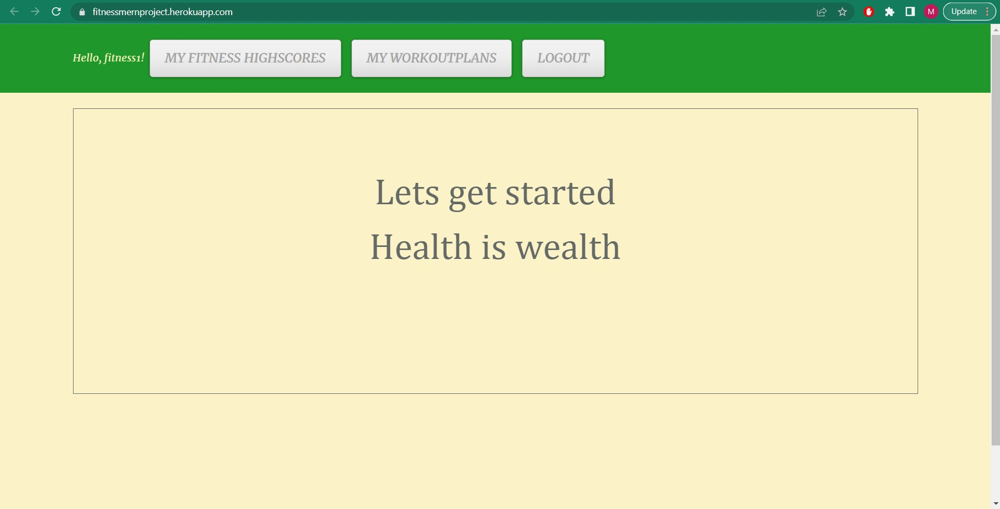

# Fitness
https://github.com/manny1998/Fitness & https://fitnessmernproject.herokuapp.com/
# Description
This MERN Project is targeted towards the fitness freaks and the gym newbies. This application has two main features which people who go to the gym will find very helpful, the first feature is that the user can add there workout plan and as they progress through there workout they can 'tick' it off and therefore there aware what stage of the workout there at. Additionally, there is another feature where the user can add there personal best (PB), this will help the user track the progress there making physically. In order to create this application, MongoDB, Node, Express and React were used. 
# Table of Contents 
* [Installation](#installation)
* [Usage](#usage)
* [License](#license)
* [Contributing](#contributing)
* [Tests](#tests)
* [Questions](#questions)
# Installation
The following necessary dependencies must be installed to run the application properly: 
* Mongo
* Express
* React
* Node 
* GraphQL
* Apollo
* JWT 
To begin installation, git clone this repository (git@github.com:manny1998/Fitness.git). Once cloned, then install the dependencies by going to the terminal and running 'npm i'. Finally run 'npm run build' and then 'npm run develop' and this should launch the application to the browser. 
# Usage
In order to use this app, click this link https://fitnessmernproject.herokuapp.com/.

Once the linked has loaded you will be redirected to the home page which looks like this: 

From here you can go to the login page if you already have an account:

Or view the benefit pages which might help motivate the user: 

If the user does not have a account then they will have to head to the sign up page:

# License
This project is licensed under the MIT license. 

# Contributing
​Contributors: Me (manny1998)
# Questions
If you have any questions about the repo, open an issue or contact manny1998 directly at : manroven@email.com.
